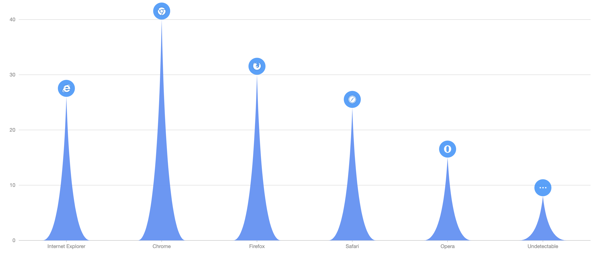

# G2Plot-Column

> Plugin based on G2Plot v2. 更多配置请参考[G2Plot 文档](https://g2plot.antv.vision/zh/examples/column/basic#basic)



## Install

```bash
$ npm i --save g2plot-column
```

## Usage

```ts
import { P } from '@antv/g2plot';
import { defaultOptions, adaptor } from '../src';

const data = [
  { name: 'Internet Explorer',
    value: 26,
    symbol: 'https://gw.alipayobjects.com/zos/rmsportal/eOYRaLPOmkieVvjyjTzM.png',
  },
  { name: 'Chrome', value: 40, symbol: 'https://gw.alipayobjects.com/zos/rmsportal/dWJWRLWfpOEbwCyxmZwu.png' },
  { name: 'Firefox', value: 30, symbol: 'https://gw.alipayobjects.com/zos/rmsportal/ZEPeDluKmAoTioCABBTc.png' },
  { name: 'Safari', value: 24, symbol: 'https://gw.alipayobjects.com/zos/rmsportal/eZYhlLzqWLAYwOHQAXmc.png' },
  { name: 'Opera', value: 15, symbol: 'https://gw.alipayobjects.com/zos/rmsportal/vXiGOWCGZNKuVVpVYQAw.png' },
  { name: 'Undetectable', value: 8, symbol: 'https://gw.alipayobjects.com/zos/rmsportal/NjApYXminrnhBgOXyuaK.png' },
];

const options = {
  data,
  xField: 'name',
  yField: 'value',
  height: 600,
  curvature: 0.8,
  autoFit: true,
  symbolSize: [40, 40],
  //padding: 40, //发现顶部图标被挡住的时候 暂时可以设置一个padding解决
};
const column = new P('app', options, adaptor, defaultOptions);
column.render();
```

## API

### Options

| Name       | Type            | Description                                                                  |
| ---------- | --------------- | ---------------------------------------------------------------------------- |
| data       | Array           | data source,example:[{xField},{yField},symbol,color,shapeAttrs]              |
| xField     | string          | x-axis field name in data                                                    |
| yField     | string          | y-axis field name in data                                                    |
| height     | number          | chart height                                                                 |
| width      | number          | chart width                                                                  |
| autoFit    | Boolean         | fit width,default:false                                                      |
| curvature  | number          | curvature,ranges:0-1,default:0.8,curvature=0 is triangle                     |
| symbolSize | Array           | symbol size,default:[30,30]                                                  |
| padding    | Array \| number | padding,default:0                                                            |
| color      | string          | shape common color/fill                                                      |
| shapeAttrs | object          | shape common shape [attrs](https://g2.antv.vision/zh/docs/manual/shape-attrs) |

### data

| Name       | Type   | Description                                                                   |
| ---------- | ------ | ----------------------------------------------------------------------------- |
| symbol     | string | image path                                                                    |
| color      | string | current shape color, priority is higher than common color|
| shapeAttrs | object | current shape [attrs](https://g2.antv.vision/zh/docs/manual/shape-attrs),priority is      higher than common shapeStyle   |